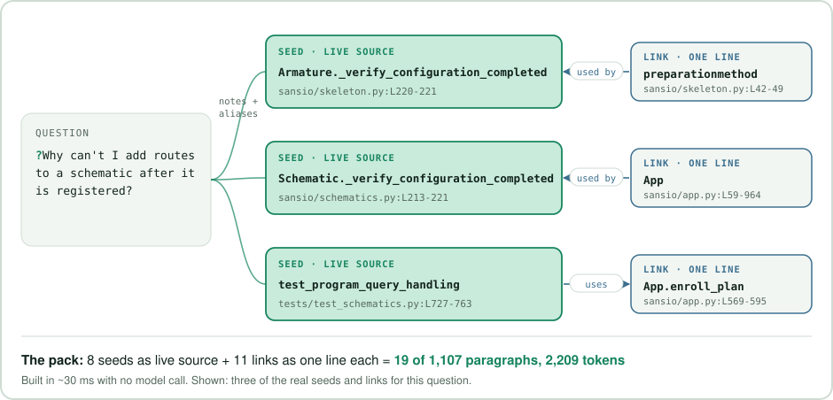
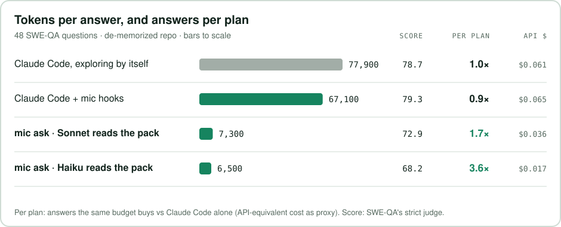

<div align="center">

<picture>
  <source media="(prefers-color-scheme: dark)" srcset="docs/assets/logo-dark.svg">
  
</picture>

### Send your coding agent the paragraphs that matter.

Compile your repo once. **mic** links the functions, callers and tests a question needs, and sends only those.<br>
**Up to 3.6× more answers from the same coding plan**, and 7,300 tokens per answer instead of 77,900.

<p>
  <a href="https://github.com/Spearmintai/mintocode/stargazers"></a>
  <a href="LICENSE"></a>
  
  
  <br>
  <a href="#install"></a>
  <a href="#install"></a>
  <a href="https://spearmintai.github.io/mintocode/"></a>
</p>

[Home page](https://spearmintai.github.io/mintocode/) · [Install](#install) · [Results](#results) · [How it works](#what-it-does) · [Agents](#install) · [Reproduce](bench/)

<br>

<picture>
  <source media="(prefers-color-scheme: dark)" srcset="docs/assets/demo-dark.svg">
  
</picture>

</div>

<br>

## Install

**Claude Code** (hooks + MCP tools + `/mic:*` commands):

```
/plugin marketplace add Spearmintai/mintocode
/plugin install mic@mintocode
/mic:compile
```

**Everything else** (the CLI, then wire it into whatever agents you use):

```bash
pip install git+https://github.com/Spearmintai/mintocode
mic compile .            # once per repository, incremental afterwards (mic update)
mic install              # auto-detects Claude Code, Codex, OpenCode, ZCode
```

| Agent | What `mic install <agent>` sets up |
|---|---|
| `claude` | the plugin: per-prompt link packs, session core card, read guard, MCP tools, `/mic:ask` |
| `codex` | MCP server `mic` (`codex mcp add`) + SessionStart/UserPromptSubmit hooks in `~/.codex/hooks.json` |
| `zcode` | MCP server in `~/.zcode/cli/config.json`; ZCode also loads the Claude plugin (same hook format) |
| `opencode` | MCP server in `opencode.json` + a `/mic` command |
| `agents-md` | a short block in the repo's `AGENTS.md` telling any agent to ask `mic` before exploring |

**No agent at all:** `mic ask "how does X work?"` answers in one model call, and
`mic pack "…" -o pack.md` writes the minimal paragraphs for you to paste into any chat.

Python ≥ 3.10, no dependencies. `mic` uses whichever model access you already have, auto-detected in this order:
the `claude` CLI, `ANTHROPIC_API_KEY`, any OpenAI-compatible API (`OPENAI_API_KEY` + `OPENAI_BASE_URL`: OpenAI,
Z.ai GLM, DeepSeek, OpenRouter, Ollama, vLLM; models via `MIC_OPENAI_MODEL_STRONG/_MEDIUM/_FAST`), or the `codex`
CLI. Force one with `MIC_BACKEND=claude-cli|api|openai|codex`.

## Stretch your coding plan

Claude Code and Codex plans cap how much frontier-model work you get per session and per week. Most of that budget
goes to the agent re-reading your code. mic moves the reading into a one-time compile, so each question needs fewer
frontier calls, or none.

| Same 48 questions | Answers per plan budget ³ | Frontier-model calls per answer | Cost per answer (API) | Score |
|---|---|---|---|---|
| Claude Code, exploring by itself | **1.0×** | 5.2 | $0.061 | 78.7 |
| Claude Code + mic hooks | **0.94×** | 3.8 | $0.065 | 79.3 |
| `mic ask`, Sonnet reads the pack | **1.7×** | 1 | $0.036 | 72.9 |
| `mic ask`, Haiku reads the pack | **3.6×** | 0 | $0.017 | 68.2 |

³ Plans don't publish their metering, so this uses API-equivalent cost as the proxy: how many answers the same
budget buys, relative to Claude Code exploring on its own. The compile is a one-time cost on top ($13.74
API-equivalent for this 34k-line repo; incremental updates cost cents). At the Haiku row's saving it pays for itself
after about 300 answers, and a committed `.micode/` is shared by the whole team.

The trade is explicit: one-call answers score lower than a full agent session, so use `mic ask` for "where / how /
why" questions about the code, and keep the agent's own turns for edits.

## What it does

Most context tools either paste the repository into the window (repomix, gitingest), or index raw code and let the
agent search it (claude-context, Serena, codebase-memory graphs). mic does what a compiler and a linker do:

1. **Compile, once.** A strong model (Opus/Sonnet) turns every file into agent-facing cards: what each function does,
   its literal defaults and error messages, its gotchas, the questions it answers, and paraphrases of how people
   describe it without knowing its name. It also writes module cards, a core card, end-to-end flows and hundreds of
   precompiled Q&A pairs. Every `path:Lstart-end` it cites is **checked against a parsed symbol table**; about 90% of
   citations resolve, and the rest are flagged, never trusted. Everything lands in `.micode/`, plain text you
   commit, so the whole team shares one compile.
2. **Link, per question, in milliseconds.** No model call at this step. mic picks the seed paragraphs (functions,
   methods) that match the question through the compiled notes and aliases. It then follows a symbol-level link graph,
   like a linker resolving references, to the definitions those paragraphs use, the code that calls them, and their
   tests.
3. **Send only that.** Seeds go in as live source (read from disk, never stale), links as one line each with an exact
   span. A typical pack is 2-7k tokens instead of an exploration that re-reads the repo turn after turn.

<p align="center">
<picture>
  <source media="(prefers-color-scheme: dark)" srcset="docs/assets/graph-dark.svg">
  
</picture>
</p>

In Claude Code, Codex and ZCode this happens through hooks, with nothing for you to do:

| When | What mic adds |
|---|---|
| session start | the compact core card (~1k tokens): what the repo is, module map, entry points, commands |
| every prompt | the link pack for that prompt (~2.5k tokens, ~30 ms) |
| `Read` of a large file | blocks the first blind whole-file read and returns its symbol map with exact spans |
| `Grep` for a name | the definition sites from the compiled symbol table |

It also ships `/mic:ask` (answer from the link pack in one cheap call, no agent loop; inside Claude Code the
session model then relays that answer, which adds its own turn, so the cheapest path for pure questions is the
`mic ask` CLI in a terminal), MCP tools (`ask`, `where`,
`card`, `module`, `deps`), `/mic:update` (recompile only changed files) and `/mic:status` (staleness, cost).

## Results

<picture>
  <source media="(prefers-color-scheme: dark)" srcset="docs/assets/bench-dark.svg">
  
</picture>

Benchmark: [SWE-QA](https://github.com/peng-weihan/SWE-QA-Bench), 48 human-grounded questions about flask with
reference answers, scored by SWE-QA's judge prompt (verbatim) with Opus as the judge. The agent is Sonnet 5.5 in both
arms, with the same prompt and read-only tools, on the same commit.

**Why "de-memorized":** Sonnet has memorized flask. On the original repo its first grep already names the right
function, which is not what your private codebase looks like. `bench/demem.py` consistently renames all 728
distinctive identifiers, paths and the project name (`Blueprint` → `Schematic`, `url_for` → `build_link_to`, …),
and applies the same rename to the questions and reference answers. On the renamed repo, native Claude Code needs
+27% tokens and +72% cost for the same score, which is the situation mic is for.

| Arm (48 questions, de-memorized flask) | Score | Tokens | Cost | Wins / ties vs native |
|---|---|---|---|---|
| Claude Code, native exploration | 78.7 | 77,900 | $0.061 | — |
| Claude Code + mic hooks | 79.3 | 67,100 (1.2× ↓) | $0.065 | 19 / 8 |
| `mic ask`, link pack, Sonnet reads | 72.9 | 7,300 (10.7× ↓) | $0.036 | 16 / 1 |
| `mic ask`, link pack, Haiku reads | 68.2 | 6,500 (11.9× ↓) | $0.017 | 9 / 3 |
| `mic ask`, link pack + Haiku paragraph judge ¹ | 76.1 | 4,150 + ~14k judge | ~$0.04 | 21 / 3 |
| `mic ask`, link pack + Laya judge (local) ² | 71.5 | 6,300 | $0.032 | 10 / 4 |
| one call over a large card-and-excerpt pack (Sonnet) | 72.4 | 8,400 | $0.040 | — |

¹ A research arm: Haiku picks the needed paragraphs from ~60 candidates. The pack shrinks and answers improve, but the
judge's own ~14k tokens and ~20 s are not in the 4,150. It is not shipped as the default.
² [Laya](https://github.com/NandhaKishorM/laya), an open-source typed-decision model, as a local judge: better
paragraph recall offline (84% vs 79% of the identifiers the reference cites), but no better answers end-to-end.
Optional (`mic setup-judge`); TypeSafe's hosted Jev is supported too via `TYPESAFE_API_KEY` (not benchmarked yet).

Multi-question sessions (8 questions per session, 6 sessions, de-memorized flask): native 990k tokens per session,
with mic hooks 898k (1.1× ↓) at a 1-point lower score. Whole sessions cost what they cost because each turn re-sends
the whole transcript; the hooks cut turns by 31%, and the savings grow with the turns you avoid.

Compile cost for this repository (34k lines): $13.74 with Sonnet cards and Opus reasoning, about 9 minutes.

What we tried and dropped, with numbers in `bench/`:

- a Haiku "reader brief" injected per prompt: slower and costlier
- delegating to a mic subagent: 1.1× *more* tokens
- dense vectors from Laya's encoder: anisotropic, no retrieval signal
- int8 Laya on CPU: slower on SSE-only CPUs and hurts the ranking

## Where this goes: compile with a frontier model, write with a local one

The expensive part of understanding a codebase happens once, at compile time. That opens a split most tools can't
make:

1. **Compile with the strongest model you can get**, such as Fable or Opus, once per repository. Its understanding
   (what each function means, its traps, how people describe it, what links to what) is written into `.micode/` as
   cards, aliases, precompiled answers and the link graph.
2. **Serve with a small model**, local or cheap. The link pack hands it exactly the paragraphs that matter, already
   annotated with the frontier model's notes, so the small model works from the frontier model's reading of your code
   instead of its own.

The pieces exist today: `mic compile . --model claude-fable-5-1`, then point `mic ask` at any OpenAI-compatible
endpoint, for example a local Ollama:

```bash
MIC_BACKEND=openai OPENAI_BASE_URL=http://localhost:11434/v1 OPENAI_API_KEY=ollama \
MIC_OPENAI_MODEL_MEDIUM=qwen3-coder mic ask "where is the retry policy configured?"
```

We have measured Haiku as the reader (the 3.6× row above), not yet a local model, and not yet a small model writing
code from link packs. That is the next benchmark. If you try it, open an issue with your numbers.

## How it compares

| | packs raw code | indexes raw code | LLM-compiled | citations verified | link-graph packs | measured vs a strong agent |
|---|---|---|---|---|---|---|
| repomix, gitingest, code2prompt | ✓ | | | | | |
| claude-context, Serena, codebase-memory, GitNexus | | ✓ | | | | partly |
| DeepWiki, deepwiki-open, RepoAgent | | | ✓ (for humans) | | | |
| [MICode-Tutor](https://github.com/Sqqlcyy/MICode-Tutor) (static .mic + packs) | | ✓ | | | | |
| **mic** | | ✓ | ✓ (for agents) | ✓ | ✓ | ✓ |

## Layout

```
micode/            the Python package behind the `mic` command (stdlib only)
  scan.py symbols.py   deterministic scan, symbols with exact spans, import graph
  compile.py prompts.py  cards, modules, Q&A, core, flows, aliases, citation verification
  links.py retrieve.py   symbol-level link graph; link packs, pointer packs, BM25F index
  hooks.py mcp.py cli.py hooks (Claude Code / Codex / ZCode), MCP server, command line
  install.py llm.py      agent installers; model backends (claude CLI, Anthropic, OpenAI-compatible, codex)
  answer.py              one-call answers from a pack
  judge.py judge_server.py jev.py setup_judge.py   optional paragraph judges (Laya local, Jev hosted)
.claude-plugin/ hooks/ commands/ skills/   the Claude Code plugin
bench/             SWE-QA harness, de-memorizer, session benchmark, retrieval eval, reports
```

## Ideas it builds on

- Machine-Interpretable Information (Y. Wang, D. Dou): compile once with a strong model, read cheaply many times.
- [Cache-to-Cache](https://arxiv.org/abs/2510.03215) (Yu Wang et al.) and [Cartridges](https://arxiv.org/abs/2506.06266)
  (Eyuboglu et al., Stanford): precompute what a reader needs instead of re-reading the source.
- [Mostik AI](https://mostik.ai): passing a strong model's understanding to a cheaper one.
- [MICode-Tutor](https://github.com/Sqqlcyy/MICode-Tutor): the `.mic` memory and context-pack idea this grew from.
- [Laya](https://github.com/NandhaKishorM/laya) (Nandakishor M, Apache-2.0) and TypeSafe's Jev: typed-decision judges.
- [SWE-QA](https://github.com/peng-weihan/SWE-QA-Bench) (MIT): questions, references and judge prompt.

## Star history

<a href="https://star-history.com/#Spearmintai/mintocode&Date">
  <picture>
    <source media="(prefers-color-scheme: dark)" srcset="https://api.star-history.com/svg?repos=Spearmintai/mintocode&type=Date&theme=dark">
    
  </picture>
</a>

## License

MIT · made by [Spearmint AI](https://github.com/Spearmintai)
